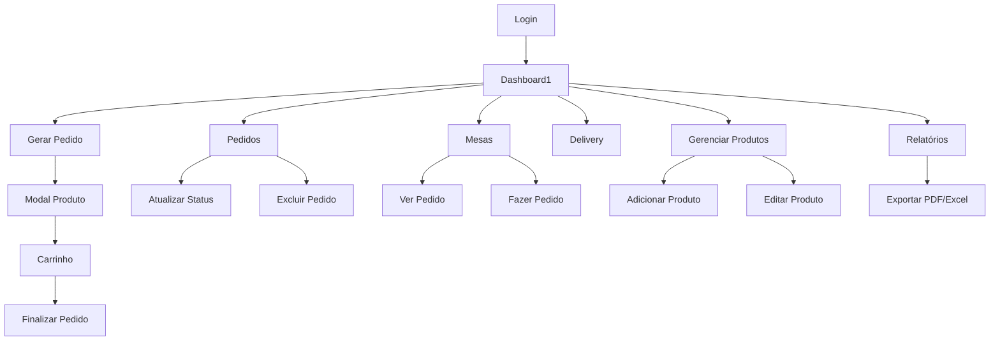
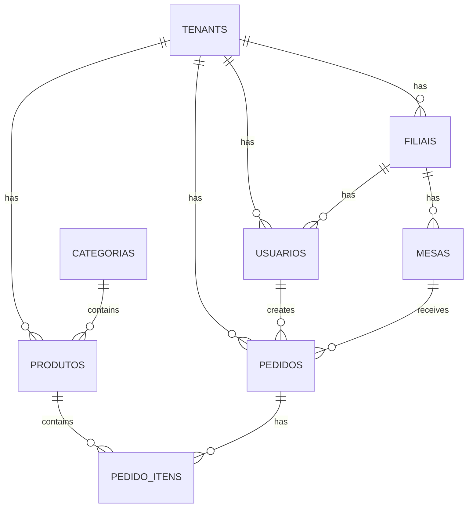

# Análise Completa do Sistema Divino Lanches 2.0

## Índice
1. [Visão Geral do Sistema](#visão-geral-do-sistema)
2. [Arquitetura e Estrutura](#arquitetura-e-estrutura)
3. [Análise Detalhada por Módulo](#análise-detalhada-por-módulo)
4. [Relacionamentos entre Páginas](#relacionamentos-entre-páginas)
5. [Design e Interface](#design-e-interface)
6. [Implementação Multi-Tenant SaaS](#implementação-multi-tenant-saas)
7. [Tecnologias e Dependências](#tecnologias-e-dependências)
8. [Estrutura de Banco de Dados](#estrutura-de-banco-de-dados)

---

## 1. Visão Geral do Sistema

### Propósito
O **Divino Lanches 2.0** é um sistema de gestão completo para lanchonetes e restaurantes, desenvolvido em PHP com arquitetura MVC personalizada. O sistema gerencia pedidos (mesas e delivery), estoque, finanças, clientes e fornece relatórios detalhados.

### Funcionalidades Principais
- **Gestão de Pedidos**: Sistema completo para pedidos em mesa e delivery
- **Controle de Mesas**: Visualização em tempo real do status das mesas
- **Gestão de Produtos**: CRUD completo com categorias e ingredientes
- **Controle de Estoque**: Monitoramento de produtos com baixo estoque
- **Gestão Financeira**: Controle de receitas, despesas e fluxo de caixa
- **Relatórios**: Análises detalhadas de vendas e performance
- **Agenda**: Sistema de agendamento de atividades
- **Autenticação**: Sistema de login com níveis de usuário

---

## 2. Arquitetura e Estrutura

### Padrão MVC Personalizado
```
mvc/
├── app/           # Aplicações específicas
├── classes/       # Classes do sistema (System)
├── common/        # Componentes compartilhados
│   ├── header.php # Cabeçalho padrão
│   ├── footer.php # Rodapé padrão
│   └── layout.php # Layout principal
├── config/        # Configurações
├── controller/    # Controladores
├── model/         # Modelos e acesso a dados
└── views/         # Views/templates
```

### Sistema de Roteamento
- **Roteamento via GET**: `index.php?view=nome_da_view`
- **Views permitidas**: Definidas em `mvc/config/views.php`
- **Fallback**: Sistema tenta carregar controller, depois view diretamente

### Configuração e Ambiente
- **Variáveis de ambiente**: Configuração via `.env`
- **Singleton Config**: Classe para gerenciar configurações
- **URL dinâmica**: Detecção automática de protocolo e domínio

---

## 3. Análise Detalhada por Módulo

### 3.1 Sistema de Autenticação

#### Arquivo Principal: `mvc/model/login.php`
**Funcionalidades:**
- Validação de credenciais contra tabela `usuarios`
- Suporte a `password_hash()` e MD5 (legacy)
- Criação de sessão com dados do usuário
- Redirecionamento após login bem-sucedido

**Fluxo:**
1. Recebe POST com login/senha
2. Busca usuário no banco
3. Valida senha (hash ou MD5)
4. Cria sessão com dados do usuário
5. Redireciona para dashboard

#### Arquivo: `mvc/model/logout.php`
- Destroi sessão completa
- Redireciona para página de login

### 3.2 Dashboard Principal

#### Arquivo: `mvc/views/Dashboard1.php`
**Funcionalidades:**
- **Cards de Ação Rápida**: Mesas, Delivery, Produtos, Relatórios, Categorias, Pedidos
- **Visualização de Mesas**: Grid com status em tempo real (Livre/Ocupada)
- **Informações de Pedidos**: Valor total por mesa, quantidade de pedidos
- **Modal de Pedido**: Visualização detalhada com itens e ingredientes
- **Ações**: Fazer pedido, fechar todos, converter para delivery

**Design:**
- Layout responsivo com Bootstrap
- Cards coloridos baseados no status
- Atualização automática via JavaScript
- Modal para detalhes do pedido

**JavaScript Principal:**
```javascript
// Atualização automática das mesas
function atualizarMesas() {
    // AJAX para buscar status atual das mesas
}

// Visualizar pedido detalhado
function verPedido(pedidoId) {
    // Busca dados via AJAX e exibe em modal
}

// Converter pedido para delivery
function converterParaDelivery(pedidoId) {
    // SweetAlert2 para coletar dados do cliente
}
```

### 3.3 Sistema de Pedidos

#### Arquivo: `mvc/views/gerar_pedido.php`
**Funcionalidades:**
- **Busca de Produtos**: Campo de pesquisa com filtro em tempo real
- **Categorias**: Filtro por categoria de produto
- **Modal de Produto**: Customização de quantidade, ingredientes, observações
- **Carrinho**: Gerenciamento de itens selecionados
- **Finalização**: Criação do pedido no banco

**Fluxo de Criação:**
1. Usuário seleciona mesa
2. Busca e filtra produtos
3. Clica no produto → abre modal
4. Customiza produto (ingredientes, quantidade, observação)
5. Adiciona ao carrinho
6. Finaliza pedido → salva no banco

**JavaScript:**
```javascript
// Modal de produto
function showProductModal(product) {
    // Carrega ingredientes via AJAX
    // Permite customização
}

// Adicionar ao carrinho
function addToCart() {
    // Envia dados via AJAX para carrinho.php
}

// Finalizar pedido
function finalizarPedido() {
    // Submete carrinho para criar pedido
}
```

#### Arquivo: `mvc/views/pedidos.php`
**Funcionalidades:**
- **Pipeline Kanban**: Pedidos organizados por status
- **Filtros**: Data, mesa, delivery
- **Status em Tempo Real**: Contador de tempo decorrido
- **Ações**: Atualizar status, excluir, visualizar detalhes

**Status do Pipeline:**
- Pendente → Em Preparo → Pronto → Saiu para Entrega → Entregue
- Cancelado

**Design:**
- Colunas coloridas por status
- Cards expansíveis com detalhes
- Botões de ação por status

### 3.4 Gestão de Mesas

#### Arquivo: `mvc/views/mesas.php`
**Funcionalidades:**
- **Grid de Mesas**: Visualização de todas as mesas
- **Status Visual**: Cores diferentes para livre/ocupada
- **Informações de Pedidos**: Valor total e quantidade
- **Ações**: Ver pedido, fazer novo pedido, fechar todos

**Design:**
- Cards responsivos
- Cores baseadas no status
- Modal para edição de pedidos

### 3.5 Sistema de Delivery

#### Arquivo: `mvc/views/delivery.php`
**Funcionalidades:**
- **Pipeline de Delivery**: Status específicos para delivery
- **Busca**: Por cliente, telefone, endereço
- **Informações do Cliente**: Nome, telefone, endereço
- **Ações**: Marcar como entregue, imprimir, excluir

**Status:**
- Pendente → Em Preparo → Saiu para Entrega → Entregue → Cancelado

### 3.6 Gestão de Produtos

#### Arquivo: `mvc/views/gerenciar_produtos.php`
**Funcionalidades:**
- **DataTables**: Tabela com busca, ordenação, paginação
- **Modal de Adição**: Formulário completo para novo produto
- **Modal de Edição**: Pré-preenchido com dados existentes
- **Exclusão**: Com confirmação via SweetAlert2

**Campos do Produto:**
- Nome, categoria, preços (normal/mini)
- Descrição, imagem, estoque, custo, marca

#### Arquivo: `mvc/views/gerenciar_categorias.php`
**Funcionalidades:**
- **Grid de Categorias**: Cards com imagem e nome
- **Upload de Imagem**: Preview antes do upload
- **CRUD Completo**: Adicionar, editar, excluir

### 3.7 Controle de Estoque

#### Arquivo: `mvc/views/estoque.php`
**Funcionalidades:**
- **Produtos em Baixo Estoque**: Lista produtos ≤ estoque mínimo
- **Exportação Excel**: Relatório via SheetJS
- **Alertas Visuais**: Cards vermelhos para produtos críticos

### 3.8 Gestão Financeira

#### Arquivo: `mvc/views/financeiro.php`
**Funcionalidades:**
- **Menu Principal**: 3 opções (Resultados, Despesas, Entradas)
- **Relatórios Mensais**: Receitas vs despesas
- **Controle de Status**: Pago/Pendente
- **Exclusão**: Com confirmação

**Fluxo:**
1. Usuário escolhe opção no menu
2. Se "Resultados" → seleciona mês/ano
3. Exibe tabelas de receitas e despesas
4. Permite adicionar novas movimentações

### 3.9 Sistema de Relatórios

#### Arquivo: `mvc/views/relatorios/index.php`
**Funcionalidades:**
- **Filtros Avançados**: Data, status, tipo
- **Cards de Resumo**: Total pedidos, valor, delivery, mesa
- **Gráfico de Vendas**: Chart.js com vendas diárias
- **Tabelas**: Produtos mais vendidos, status dos pedidos
- **Exportação**: PDF e Excel
- **Agrupamento por Mesa**: Relatório detalhado por mesa

**Dados do Gráfico:**
- Eixo Y: Valor em R$ e quantidade de pedidos
- Eixo X: Datas do período selecionado
- Dual axis: Valor à esquerda, quantidade à direita

### 3.10 Sistema de Agenda

#### Arquivo: `agenda/index.php`
**Funcionalidades:**
- **FullCalendar**: Calendário interativo
- **Criação de Eventos**: Clique e arrastar
- **Visualização**: Modal com dados do evento
- **Edição**: Formulário inline no modal
- **Exclusão**: Com confirmação
- **Cores**: Sistema de cores para categorização

**Recursos:**
- Navegação por mês/semana/dia
- Seleção de período para criar evento
- Máscara de data/hora personalizada
- Persistência no banco via AJAX

---

## 4. Relacionamentos entre Páginas

### Fluxo Principal do Sistema



### Navegação e Links

**Dashboard1** é o hub central que conecta a:
- **Mesas**: `?view=gerar_pedido&mesa=X`
- **Delivery**: `?view=delivery`
- **Pedidos**: `?view=pedidos`
- **Produtos**: `?view=gerenciar_produtos`
- **Categorias**: `?view=gerenciar_categorias`
- **Estoque**: `?view=estoque`
- **Financeiro**: `?view=financeiro`
- **Relatórios**: `?view=relatorios`

### Modais e Popups

**Modais Principais:**
- **Produto**: Customização de ingredientes e observações
- **Pedido**: Visualização detalhada com ações
- **Configuração**: Cor do sistema e número de mesas
- **Calculadora**: Ferramenta auxiliar
- **Cliente**: Cadastro e edição

### AJAX e Comunicação

**Endpoints AJAX:**
- `mvc/model/buscar_ingredientes.php`: Ingredientes do produto
- `mvc/model/carrinho.php`: Gerenciar carrinho
- `mvc/model/buscar_pedido.php`: Dados do pedido
- `mvc/controller/atualizar_status_pedido.php`: Atualizar status
- `mvc/controller/excluir_pedido.php`: Excluir pedido

---

## 5. Design e Interface

### Framework CSS
- **Bootstrap 4**: Sistema de grid e componentes
- **Font Awesome**: Ícones
- **SweetAlert2**: Alertas e confirmações
- **DataTables**: Tabelas interativas
- **Chart.js**: Gráficos

### Cores e Temas
- **Sistema de Cores**: Configurável via sessão (`$_SESSION['cor']`)
- **Gradientes**: Bootstrap gradients para sidebar
- **Status Colors**: Verde (sucesso), Amarelo (pendente), Vermelho (erro)

### Responsividade
- **Mobile First**: Layout adaptável
- **Breakpoints**: Bootstrap padrão
- **Cards Responsivos**: Adaptação automática
- **Modais Mobile**: Otimizados para touch

### Componentes Reutilizáveis

**Header (`mvc/common/header.php`):**
- Sidebar com navegação
- Modais de configuração
- Sistema de cores dinâmico
- Logo e branding

**Footer (`mvc/common/footer.php`):**
- Scripts JavaScript
- Modais auxiliares (calculadora)
- Inicialização de componentes

**Layout (`mvc/common/layout.php`):**
- Wrapper principal
- Injeção de conteúdo
- Mensagens de sessão
- Controle de páginas sem layout

### UX/UI Patterns

**Feedback Visual:**
- Hover effects em cards
- Loading states em AJAX
- Success/error messages
- Real-time updates

**Interações:**
- Click to expand/collapse
- Drag and drop (agenda)
- Modal workflows
- Inline editing

---

## 6. Implementação Multi-Tenant SaaS

### 6.1 Arquitetura Multi-Tenant

Para transformar o sistema em um SaaS multi-tenant, será necessário implementar as seguintes modificações:

#### Estrutura de Tenants
```sql
-- Tabela de tenants (empresas)
CREATE TABLE tenants (
    id INT PRIMARY KEY AUTO_INCREMENT,
    nome VARCHAR(255) NOT NULL,
    subdomain VARCHAR(100) UNIQUE,
    domain VARCHAR(255),
    cnpj VARCHAR(18),
    telefone VARCHAR(20),
    email VARCHAR(255),
    endereco TEXT,
    logo_url VARCHAR(500),
    cor_primaria VARCHAR(7) DEFAULT '#007bff',
    status ENUM('ativo', 'inativo', 'suspenso') DEFAULT 'ativo',
    plano_id INT,
    created_at TIMESTAMP DEFAULT CURRENT_TIMESTAMP,
    updated_at TIMESTAMP DEFAULT CURRENT_TIMESTAMP ON UPDATE CURRENT_TIMESTAMP
);

-- Tabela de planos
CREATE TABLE planos (
    id INT PRIMARY KEY AUTO_INCREMENT,
    nome VARCHAR(100) NOT NULL,
    max_mesas INT DEFAULT 10,
    max_usuarios INT DEFAULT 3,
    max_produtos INT DEFAULT 100,
    max_pedidos_mes INT DEFAULT 1000,
    recursos JSON,
    preco_mensal DECIMAL(10,2),
    created_at TIMESTAMP DEFAULT CURRENT_TIMESTAMP
);

-- Tabela de filiais
CREATE TABLE filiais (
    id INT PRIMARY KEY AUTO_INCREMENT,
    tenant_id INT NOT NULL,
    nome VARCHAR(255) NOT NULL,
    endereco TEXT,
    telefone VARCHAR(20),
    email VARCHAR(255),
    cnpj VARCHAR(18),
    logo_url VARCHAR(500),
    status ENUM('ativo', 'inativo') DEFAULT 'ativo',
    created_at TIMESTAMP DEFAULT CURRENT_TIMESTAMP,
    FOREIGN KEY (tenant_id) REFERENCES tenants(id) ON DELETE CASCADE
);
```

#### Modificações no Sistema de Autenticação
```php
// mvc/model/login.php - Versão Multi-tenant
class TenantAuth {
    public function login($login, $senha, $subdomain = null) {
        // 1. Identificar tenant
        $tenant = $this->identifyTenant($subdomain);
        
        // 2. Validar credenciais no contexto do tenant
        $usuario = $this->validateUser($login, $senha, $tenant['id']);
        
        // 3. Criar sessão com contexto do tenant
        $_SESSION['tenant_id'] = $tenant['id'];
        $_SESSION['tenant_nome'] = $tenant['nome'];
        $_SESSION['filial_id'] = $usuario['filial_id'];
        
        return $usuario;
    }
    
    private function identifyTenant($subdomain) {
        if ($subdomain) {
            // Buscar por subdomain
            $sql = "SELECT * FROM tenants WHERE subdomain = ? AND status = 'ativo'";
        } else {
            // Buscar por domain principal
            $domain = $_SERVER['HTTP_HOST'];
            $sql = "SELECT * FROM tenants WHERE domain = ? AND status = 'ativo'";
        }
        
        // Executar query e retornar tenant
    }
}
```

#### Sistema de Roteamento Multi-tenant
```php
// mvc/config/routes.php
class MultiTenantRouter {
    public function resolveTenant() {
        $host = $_SERVER['HTTP_HOST'];
        
        // Verificar se é subdomain
        if (strpos($host, '.') !== false) {
            $parts = explode('.', $host);
            $subdomain = $parts[0];
            
            if ($subdomain !== 'www' && $subdomain !== 'app') {
                return $this->getTenantBySubdomain($subdomain);
            }
        }
        
        // Verificar domain personalizado
        return $this->getTenantByDomain($host);
    }
    
    public function getTenantBySubdomain($subdomain) {
        $sql = "SELECT * FROM tenants WHERE subdomain = ? AND status = 'ativo'";
        // Executar e retornar tenant
    }
}
```

#### Modificações no Banco de Dados
Todas as tabelas principais precisarão incluir `tenant_id`:

```sql
-- Exemplo: Tabela de pedidos modificada
ALTER TABLE pedido ADD COLUMN tenant_id INT NOT NULL;
ALTER TABLE pedido ADD COLUMN filial_id INT;
ALTER TABLE pedido ADD FOREIGN KEY (tenant_id) REFERENCES tenants(id);
ALTER TABLE pedido ADD FOREIGN KEY (filial_id) REFERENCES filiais(id);

-- Índices para performance
CREATE INDEX idx_pedido_tenant ON pedido(tenant_id);
CREATE INDEX idx_pedido_filial ON pedido(filial_id);

-- Aplicar para todas as tabelas principais:
-- usuarios, produtos, categorias, mesas, clientes, etc.
```

#### Middleware de Tenant
```php
// mvc/middleware/TenantMiddleware.php
class TenantMiddleware {
    public function handle() {
        // 1. Identificar tenant da requisição
        $tenant = $this->resolveTenant();
        
        if (!$tenant) {
            throw new Exception('Tenant não encontrado');
        }
        
        // 2. Verificar status do tenant
        if ($tenant['status'] !== 'ativo') {
            throw new Exception('Tenant inativo ou suspenso');
        }
        
        // 3. Verificar limites do plano
        $this->checkPlanLimits($tenant);
        
        // 4. Definir contexto global
        $this->setTenantContext($tenant);
    }
    
    private function checkPlanLimits($tenant) {
        $plano = $this->getPlan($tenant['plano_id']);
        
        // Verificar número de mesas
        $mesas_count = $this->countMesas($tenant['id']);
        if ($mesas_count >= $plano['max_mesas']) {
            throw new Exception('Limite de mesas atingido');
        }
        
        // Verificar número de usuários
        $usuarios_count = $this->countUsuarios($tenant['id']);
        if ($usuarios_count >= $plano['max_usuarios']) {
            throw new Exception('Limite de usuários atingido');
        }
    }
}
```

### 6.2 Sistema de Onboarding

#### Página de Registro de Tenant
```php
// register.php
class TenantRegistration {
    public function register($dados) {
        // 1. Validar dados
        $this->validateData($dados);
        
        // 2. Verificar disponibilidade do subdomain
        if (!$this->isSubdomainAvailable($dados['subdomain'])) {
            throw new Exception('Subdomain já está em uso');
        }
        
        // 3. Criar tenant
        $tenant_id = $this->createTenant($dados);
        
        // 4. Criar usuário administrador
        $this->createAdminUser($tenant_id, $dados);
        
        // 5. Configurar dados iniciais
        $this->setupInitialData($tenant_id);
        
        // 6. Enviar email de boas-vindas
        $this->sendWelcomeEmail($dados);
        
        return $tenant_id;
    }
    
    private function setupInitialData($tenant_id) {
        // Criar categorias padrão
        $this->createDefaultCategories($tenant_id);
        
        // Criar mesas padrão
        $this->createDefaultMesas($tenant_id);
        
        // Configurar dados do estabelecimento
        $this->setupEstablishmentData($tenant_id);
    }
}
```

### 6.3 Sistema de Billing

#### Integração com Gateway de Pagamento
```php
// billing/PaymentGateway.php
class PaymentGateway {
    public function createSubscription($tenant_id, $plano_id) {
        $tenant = $this->getTenant($tenant_id);
        $plano = $this->getPlan($plano_id);
        
        // Criar assinatura no gateway (Stripe, PagSeguro, etc.)
        $subscription = $this->gateway->subscriptions->create([
            'customer' => $tenant['gateway_customer_id'],
            'items' => [
                ['price' => $plano['gateway_price_id']]
            ],
            'metadata' => [
                'tenant_id' => $tenant_id
            ]
        ]);
        
        // Salvar no banco
        $this->saveSubscription($tenant_id, $subscription);
        
        return $subscription;
    }
    
    public function handleWebhook($payload) {
        $event = $payload['type'];
        
        switch ($event) {
            case 'invoice.payment_succeeded':
                $this->handlePaymentSuccess($payload);
                break;
            case 'invoice.payment_failed':
                $this->handlePaymentFailed($payload);
                break;
            case 'customer.subscription.deleted':
                $this->handleSubscriptionCanceled($payload);
                break;
        }
    }
}
```

### 6.4 Dashboard Administrativo

#### Painel de Controle do SaaS
```php
// admin/dashboard.php
class AdminDashboard {
    public function getStats() {
        return [
            'total_tenants' => $this->countActiveTenants(),
            'total_revenue' => $this->getMonthlyRevenue(),
            'new_signups' => $this->getNewSignups(),
            'churn_rate' => $this->getChurnRate(),
            'top_plans' => $this->getPopularPlans()
        ];
    }
    
    public function getTenantList($filters = []) {
        // Listar tenants com filtros
        // Status, plano, data de criação, etc.
    }
    
    public function suspendTenant($tenant_id, $reason) {
        // Suspender tenant por inadimplência
        $this->updateTenantStatus($tenant_id, 'suspenso');
        $this->logAction($tenant_id, 'suspended', $reason);
    }
}
```

### 6.5 Modificações nas Views

#### Contexto de Tenant nas Views
```php
// mvc/views/Dashboard1.php - Versão Multi-tenant
<?php
// Incluir contexto do tenant
$tenant = getTenantContext();
$filial = getCurrentFilial();

// Modificar queries para incluir tenant_id
$mesas_query = "SELECT * FROM mesas WHERE tenant_id = ? AND filial_id = ?";
$stmt = $conn->prepare($mesas_query);
$stmt->bind_param("ii", $tenant['id'], $filial['id']);
?>
```

#### Seleção de Filial
```php
// mvc/views/filial_selector.php
<div class="filial-selector">
    <select id="filialSelect" onchange="changeFilial(this.value)">
        <?php foreach ($filiais as $filial): ?>
            <option value="<?php echo $filial['id']; ?>" 
                    <?php echo $filial['id'] == $_SESSION['filial_id'] ? 'selected' : ''; ?>>
                <?php echo htmlspecialchars($filial['nome']); ?>
            </option>
        <?php endforeach; ?>
    </select>
</div>
```

### 6.6 Estrutura de Arquivos para SaaS

```
saas/
├── app/
│   ├── Http/
│   │   ├── Middleware/
│   │   │   ├── TenantMiddleware.php
│   │   │   └── PlanLimitsMiddleware.php
│   │   └── Controllers/
│   │       ├── TenantController.php
│   │       ├── BillingController.php
│   │       └── AdminController.php
│   ├── Models/
│   │   ├── Tenant.php
│   │   ├── Plan.php
│   │   ├── Subscription.php
│   │   └── Filial.php
│   └── Services/
│       ├── TenantService.php
│       ├── BillingService.php
│       └── OnboardingService.php
├── config/
│   ├── tenant.php
│   ├── billing.php
│   └── plans.php
├── database/
│   ├── migrations/
│   │   ├── create_tenants_table.php
│   │   ├── create_plans_table.php
│   │   └── add_tenant_columns.php
│   └── seeders/
│       ├── DefaultPlansSeeder.php
│       └── DefaultCategoriesSeeder.php
├── resources/
│   ├── views/
│   │   ├── tenant/
│   │   │   ├── register.blade.php
│   │   │   └── onboarding.blade.php
│   │   └── admin/
│   │       ├── dashboard.blade.php
│   │       └── tenants.blade.php
│   └── assets/
│       ├── css/tenant.css
│       └── js/tenant.js
└── routes/
    ├── tenant.php
    ├── admin.php
    └── billing.php
```

### 6.7 Configuração de Planos

#### Estrutura de Planos
```php
// config/plans.php
return [
    'starter' => [
        'name' => 'Starter',
        'price' => 29.90,
        'limits' => [
            'mesas' => 5,
            'usuarios' => 2,
            'produtos' => 50,
            'pedidos_mes' => 500,
            'filiais' => 1
        ],
        'features' => [
            'relatorios_basicos',
            'suporte_email'
        ]
    ],
    'professional' => [
        'name' => 'Professional',
        'price' => 79.90,
        'limits' => [
            'mesas' => 15,
            'usuarios' => 5,
            'produtos' => 200,
            'pedidos_mes' => 2000,
            'filiais' => 3
        ],
        'features' => [
            'relatorios_avancados',
            'integracao_ifood',
            'suporte_prioritario',
            'backup_automatico'
        ]
    ],
    'enterprise' => [
        'name' => 'Enterprise',
        'price' => 199.90,
        'limits' => [
            'mesas' => -1, // Ilimitado
            'usuarios' => -1,
            'produtos' => -1,
            'pedidos_mes' => -1,
            'filiais' => -1
        ],
        'features' => [
            'relatorios_customizados',
            'api_acesso',
            'suporte_dedicado',
            'white_label',
            'integracoes_avancadas'
        ]
    ]
];
```

### 6.8 Migração do Sistema Atual

#### Script de Migração
```php
// migration/convert_to_saas.php
class ConvertToSaaS {
    public function migrate() {
        // 1. Criar tenant padrão
        $tenant_id = $this->createDefaultTenant();
        
        // 2. Adicionar colunas tenant_id em todas as tabelas
        $this->addTenantColumns();
        
        // 3. Atualizar dados existentes com tenant_id padrão
        $this->updateExistingData($tenant_id);
        
        // 4. Criar usuário administrador do tenant
        $this->createTenantAdmin($tenant_id);
        
        // 5. Configurar plano inicial
        $this->setupInitialPlan($tenant_id);
    }
    
    private function addTenantColumns() {
        $tables = [
            'usuarios', 'produtos', 'categorias', 'mesas', 
            'pedido', 'pedido_itens', 'clientes', 'ingredientes'
        ];
        
        foreach ($tables as $table) {
            $sql = "ALTER TABLE {$table} ADD COLUMN tenant_id INT NOT NULL DEFAULT 1";
            $this->execute($sql);
            
            $sql = "ALTER TABLE {$table} ADD COLUMN filial_id INT";
            $this->execute($sql);
        }
    }
}
```

---

## 7. Tecnologias e Dependências

### Backend
- **PHP 7.4+**: Linguagem principal
- **MySQL 5.7+**: Banco de dados
- **MySQLi**: Driver de conexão
- **Composer**: Gerenciamento de dependências

### Frontend
- **Bootstrap 4**: Framework CSS
- **jQuery 3.6**: Manipulação DOM e AJAX
- **Font Awesome 5**: Ícones
- **SweetAlert2**: Alertas e confirmações
- **DataTables**: Tabelas interativas
- **Chart.js**: Gráficos
- **FullCalendar**: Sistema de agenda
- **SheetJS**: Exportação Excel

### Ferramentas de Desenvolvimento
- **Docker**: Containerização
- **Apache**: Servidor web
- **Git**: Controle de versão

### Dependências Externas
- **CDN**: Bootstrap, jQuery, Font Awesome
- **APIs**: Integração com gateways de pagamento
- **SMTP**: Envio de emails

---

## 8. Estrutura de Banco de Dados

### Tabelas Principais

#### Tabela `usuarios`
```sql
CREATE TABLE usuarios (
    id INT PRIMARY KEY AUTO_INCREMENT,
    login VARCHAR(50) UNIQUE NOT NULL,
    senha VARCHAR(255) NOT NULL,
    nivel ENUM('admin', 'operador') DEFAULT 'operador',
    tenant_id INT NOT NULL,
    filial_id INT,
    created_at TIMESTAMP DEFAULT CURRENT_TIMESTAMP,
    FOREIGN KEY (tenant_id) REFERENCES tenants(id),
    FOREIGN KEY (filial_id) REFERENCES filiais(id)
);
```

#### Tabela `produtos`
```sql
CREATE TABLE produtos (
    id INT PRIMARY KEY AUTO_INCREMENT,
    nome VARCHAR(255) NOT NULL,
    categoria_id INT,
    preco_normal DECIMAL(10,2),
    preco_mini DECIMAL(10,2),
    descricao TEXT,
    imagem VARCHAR(500),
    estoque_atual INT DEFAULT 0,
    estoque_minimo INT DEFAULT 0,
    preco_custo DECIMAL(10,2),
    marca VARCHAR(100),
    tenant_id INT NOT NULL,
    filial_id INT,
    created_at TIMESTAMP DEFAULT CURRENT_TIMESTAMP,
    FOREIGN KEY (categoria_id) REFERENCES categorias(id),
    FOREIGN KEY (tenant_id) REFERENCES tenants(id),
    FOREIGN KEY (filial_id) REFERENCES filiais(id)
);
```

#### Tabela `pedido`
```sql
CREATE TABLE pedido (
    idpedido INT PRIMARY KEY AUTO_INCREMENT,
    idmesa INT,
    cliente VARCHAR(255),
    delivery BOOLEAN DEFAULT FALSE,
    data DATE NOT NULL,
    hora_pedido TIME NOT NULL,
    status ENUM('Pendente', 'Em Preparo', 'Pronto', 'Saiu para Entrega', 'Entregue', 'Finalizado', 'Cancelado') DEFAULT 'Pendente',
    valor_total DECIMAL(10,2),
    observacao TEXT,
    usuario_id INT,
    tenant_id INT NOT NULL,
    filial_id INT,
    created_at TIMESTAMP DEFAULT CURRENT_TIMESTAMP,
    FOREIGN KEY (idmesa) REFERENCES mesas(id_mesa),
    FOREIGN KEY (usuario_id) REFERENCES usuarios(id),
    FOREIGN KEY (tenant_id) REFERENCES tenants(id),
    FOREIGN KEY (filial_id) REFERENCES filiais(id)
);
```

#### Tabela `pedido_itens`
```sql
CREATE TABLE pedido_itens (
    id INT PRIMARY KEY AUTO_INCREMENT,
    pedido_id INT NOT NULL,
    produto_id INT NOT NULL,
    quantidade INT NOT NULL,
    valor_unitario DECIMAL(10,2),
    valor_total DECIMAL(10,2),
    observacao TEXT,
    tamanho ENUM('normal', 'mini') DEFAULT 'normal',
    tenant_id INT NOT NULL,
    FOREIGN KEY (pedido_id) REFERENCES pedido(idpedido) ON DELETE CASCADE,
    FOREIGN KEY (produto_id) REFERENCES produtos(id),
    FOREIGN KEY (tenant_id) REFERENCES tenants(id)
);
```

### Relacionamentos



---

## Conclusão

O sistema Divino Lanches 2.0 apresenta uma arquitetura sólida e bem estruturada para gestão de lanchonetes e restaurantes. A implementação do padrão MVC personalizado, combinada com tecnologias modernas no frontend, oferece uma base excelente para transformação em SaaS multi-tenant.

### Pontos Fortes do Sistema Atual:
1. **Arquitetura MVC bem definida**
2. **Interface responsiva e intuitiva**
3. **Funcionalidades completas para o negócio**
4. **Sistema de autenticação robusto**
5. **Relatórios e análises detalhadas**

### Oportunidades para SaaS:
1. **Multi-tenancy com isolamento de dados**
2. **Sistema de planos e billing**
3. **Onboarding automatizado**
4. **Dashboard administrativo**
5. **Escalabilidade horizontal**

A transformação para SaaS requer modificações significativas na arquitetura, especialmente no sistema de autenticação, banco de dados e roteamento, mas a base atual fornece uma excelente fundação para essa evolução.
