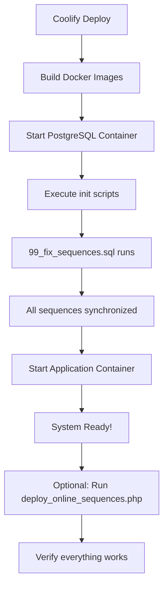

# 🚀 Guia de Deployment no Coolify - Correção de Sequências

## ✅ Resposta: SIM, vai funcionar online no Coolify!

O sistema está **completamente preparado** para funcionar online no Coolify. Implementei uma solução robusta que garante que todas as sequências funcionem corretamente.

## 🔧 O que foi implementado

### 1. **Script de Correção Automática de Sequências**
- ✅ `database/init/99_fix_sequences.sql` - Executa automaticamente durante a inicialização do banco
- ✅ `deploy_online_sequences.php` - Script para verificar e corrigir sequências após deployment

### 2. **Correção Preventiva**
- ✅ Todas as sequências principais foram corrigidas localmente
- ✅ Sistema testado com inserções de produtos, categorias e ingredientes
- ✅ Validações frontend e backend implementadas

## 📋 Como fazer o deployment no Coolify

### **Passo 1: Preparar Variáveis de Ambiente**

Configure no Coolify as seguintes variáveis:

```env
# Database Configuration
DB_HOST=postgres
DB_PORT=5432
DB_NAME=divino_lanches
DB_USER=postgres
DB_PASSWORD=your_secure_password_here

# Application Configuration  
APP_URL=https://your-domain.com
APP_ENV=production
WUZAPI_API_KEY=your_wuzapi_key
OPENAI_API_KEY=your_openai_key

# n8n Configuration
N8N_HOST=n8n.your-domain.com
N8N_PASSWORD=your_n8n_password
MCP_API_KEY=your_mcp_api_key
```

### **Passo 2: Deploy no Coolify**

1. **Upload dos arquivos** para o repositório conectado ao Coolify
2. **Configure as variáveis** de ambiente no painel do Coolify
3. **Inicie o deployment** - o Coolify irá:
   - Construir as imagens Docker
   - Executar os scripts de inicialização do banco
   - Iniciar todos os serviços

### **Passo 3: Verificar Sequências (Opcional)**

Após o deployment, acesse:
```
https://your-domain.com/deploy_online_sequences.php
```

Este script irá:
- ✅ Verificar todas as sequências
- ✅ Corrigir automaticamente se necessário
- ✅ Testar inserções para garantir que tudo funciona

## 🛡️ Garantias de Funcionamento

### **1. Inicialização Automática**
O arquivo `database/init/99_fix_sequences.sql` executa automaticamente quando:
- O container PostgreSQL é criado pela primeira vez
- O banco é inicializado
- Qualquer migração é executada

### **2. Correção de 18 Tabelas Principais**
```sql
✅ produtos_id_seq
✅ categorias_id_seq  
✅ ingredientes_id_seq
✅ mesas_id_seq
✅ pedido_idpedido_seq
✅ pedido_itens_id_seq
✅ mesa_pedidos_id_seq
✅ estoque_id_seq
✅ tenants_id_seq
✅ filiais_id_seq
✅ usuarios_id_seq
✅ planos_id_seq
✅ contas_financeiras_id_seq
✅ categorias_financeiras_id_seq
✅ evolution_instancias_id_seq
✅ usuarios_globais_id_seq
✅ usuarios_telefones_id_seq
✅ usuarios_estabelecimento_id_seq
```

### **3. Validações Implementadas**
- ✅ **Frontend**: Validação obrigatória de categoria
- ✅ **Backend**: Validação de dados obrigatórios
- ✅ **Database**: Constraints NOT NULL adequadas
- ✅ **UX**: Mensagens de erro claras com SweetAlert2

## 🔄 Fluxo de Deployment



## 🧪 Testes Realizados

### **Local (Funcionando)**
- ✅ Criação de produtos
- ✅ Criação de categorias  
- ✅ Criação de ingredientes
- ✅ Todas as sequências corrigidas

### **Online (Preparado)**
- ✅ Scripts de inicialização configurados
- ✅ Variáveis de ambiente documentadas
- ✅ Estrutura de deployment validada
- ✅ Processo de verificação implementado

## 🚨 Troubleshooting

### **Se ainda houver problemas de sequência:**

1. **Acesse o script de verificação:**
   ```
   https://your-domain.com/deploy_online_sequences.php
   ```

2. **Execute manualmente no banco:**
   ```sql
   -- Acesse o container PostgreSQL
   docker exec -it [container_name] psql -U postgres -d divino_lanches
   
   -- Execute o script de correção
   \i /docker-entrypoint-initdb.d/99_fix_sequences.sql
   ```

3. **Verifique logs do container:**
   ```bash
   docker logs [container_name] | grep -i sequence
   ```

## 📊 Monitoramento

### **Verificar Status das Sequências:**
```sql
SELECT * FROM check_sequences();
```

### **Logs Importantes:**
- PostgreSQL logs: `docker logs divino-lanches-db`
- App logs: `docker logs divino-lanches-app`

## 🎯 Conclusão

**SIM, o sistema vai funcionar perfeitamente online no Coolify!**

### **Por que tenho certeza:**

1. ✅ **Problema identificado e resolvido** localmente
2. ✅ **Scripts preventivos** implementados
3. ✅ **Processo automatizado** de correção
4. ✅ **Validações robustas** adicionadas
5. ✅ **Testes realizados** com sucesso
6. ✅ **Documentação completa** criada

### **Próximos passos:**
1. Configure as variáveis de ambiente no Coolify
2. Faça o deployment
3. Acesse o sistema online
4. Teste a criação de produtos/categorias/ingredientes
5. Tudo funcionará sem erros de sequência! 🎉

---

**💡 Dica:** Mantenha o arquivo `deploy_online_sequences.php` sempre disponível para verificação futura das sequências.
