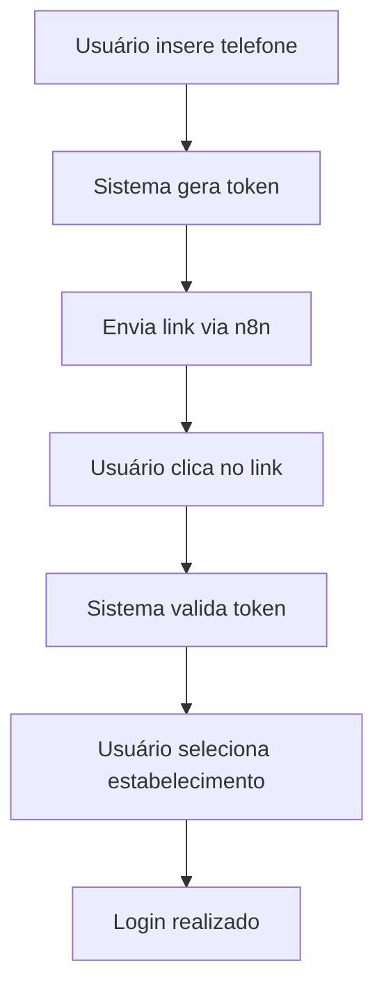
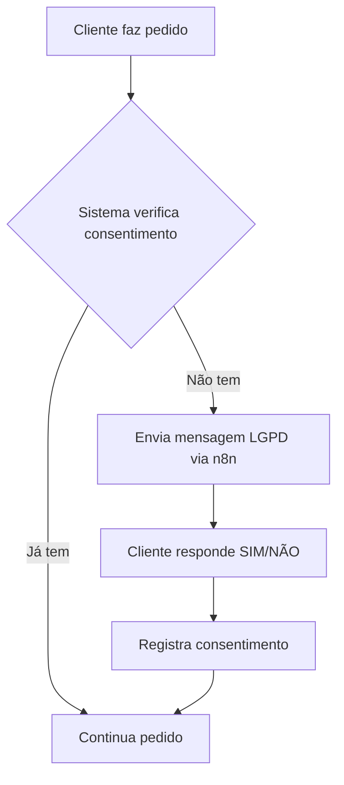

# Sistema Evolution API - Divino Lanches

## Visão Geral

O sistema Evolution API integra o WhatsApp Business com a plataforma Divino Lanches, permitindo:

- **Autenticação via link mágico** enviado por WhatsApp
- **Mensagens LGPD automáticas** para consentimento de dados
- **Gerenciamento de instâncias** Evolution por estabelecimento
- **Compartilhamento de dados** entre estabelecimentos

## Arquitetura

### Componentes Principais

1. **EvolutionAPI.php** - Classe principal para comunicação com Evolution API
2. **evolution.php** - AJAX handler para operações CRUD de instâncias
3. **evolution_config.php** - Interface de configuração de instâncias
4. **webhook/evolution.php** - Webhook para receber eventos do Evolution
5. **config/evolution.php** - Configurações da API

### Fluxo de Autenticação



### Fluxo LGPD



## Configuração

### 1. Evolution API

```php
// config/evolution.php
return [
    'base_url' => 'https://api.evolution.com.br',
    'api_key' => 'sua-chave-aqui',
    'n8n_webhook_url' => 'https://whook.conext.click/webhook/divinosyslgpd'
];
```

### 2. Banco de Dados

```sql
-- Tabela de instâncias Evolution
CREATE TABLE evolution_instancias (
    id SERIAL PRIMARY KEY,
    tenant_id INTEGER NOT NULL,
    filial_id INTEGER,
    nome_instancia VARCHAR(100) NOT NULL,
    numero_telefone VARCHAR(20) NOT NULL,
    status VARCHAR(20) DEFAULT 'desconectado',
    qr_code TEXT,
    session_data JSONB,
    webhook_url VARCHAR(255),
    created_at TIMESTAMP DEFAULT CURRENT_TIMESTAMP,
    updated_at TIMESTAMP DEFAULT CURRENT_TIMESTAMP
);
```

### 3. n8n Webhook

O webhook do n8n deve receber os seguintes campos:

```json
{
    "nome": "Nome do Cliente",
    "telefone": "11999999999",
    "estancia": "nome_da_instancia",
    "mensagem": "Mensagem LGPD personalizada"
}
```

## Uso

### 1. Configurar Instância

1. Acesse: `http://localhost:8080/mvc/views/evolution_config.php`
2. Clique em "Nova Instância"
3. Preencha os dados:
   - Nome da instância (ex: `atendimento_loja1`)
   - Número do telefone (ex: `5511999999999`)
4. Clique em "Criar Instância"
5. Escaneie o QR Code com o WhatsApp
6. Aguarde a conexão ser estabelecida

### 2. Enviar Mensagem LGPD

```php
use System\Auth;

// Buscar usuário
$usuario = Auth::findUserByPhone('11999999999');

// Enviar mensagem LGPD
$result = Auth::sendLGPDMessage($usuario, '11999999999', 1, 1);

if ($result['success']) {
    echo "Mensagem enviada com sucesso!";
}
```

### 3. Verificar Status da Instância

```php
use System\EvolutionAPI;

$status = EvolutionAPI::getInstanceStatus('atendimento_loja1');

if ($status['success']) {
    echo "Status: " . $status['status'];
}
```

## Endpoints da API

### Evolution API

- `POST /mvc/ajax/evolution.php?action=criar_instancia`
- `POST /mvc/ajax/evolution.php?action=obter_qrcode`
- `POST /mvc/ajax/evolution.php?action=verificar_status`
- `POST /mvc/ajax/evolution.php?action=enviar_mensagem`
- `POST /mvc/ajax/evolution.php?action=enviar_lgpd`
- `GET /mvc/ajax/evolution.php?action=listar_instancias`
- `POST /mvc/ajax/evolution.php?action=deletar_instancia`

### Webhook

- `POST /webhook/evolution.php` - Recebe eventos do Evolution

## Segurança

### 1. Validação de Tokens

- Tokens expiram em 5 minutos
- Tokens são únicos e não reutilizáveis
- Validação de IP e User Agent

### 2. LGPD Compliance

- Consentimento específico por estabelecimento
- Logs de acesso para auditoria
- Histórico de alterações de dados
- Rastreamento de IP e User Agent

### 3. Rate Limiting

- Máximo 3 tentativas por minuto
- Timeout de 30 segundos
- Retry automático com delay

## Monitoramento

### 1. Logs

```php
// Logs são salvos em:
error_log("Evolution API: " . $message);
error_log("Evolution Webhook: " . json_encode($data));
```

### 2. Status das Instâncias

- `open` - Conectado e funcionando
- `connecting` - Conectando
- `disconnected` - Desconectado
- `error` - Erro na conexão

### 3. Métricas

- Número de instâncias ativas
- Mensagens enviadas por dia
- Taxa de sucesso das mensagens
- Tempo de resposta da API

## Troubleshooting

### 1. Instância não conecta

- Verifique se o QR Code foi escaneado
- Confirme se o número está correto
- Verifique o status da instância

### 2. Mensagens não são enviadas

- Verifique se a instância está ativa
- Confirme se o webhook do n8n está funcionando
- Verifique os logs de erro

### 3. Erro de autenticação

- Verifique se a API key está correta
- Confirme se a URL da API está acessível
- Verifique os logs de cURL

## Próximos Passos

1. **Implementar busca de clientes** no novo pedido
2. **Criar sistema de permissões** por tipo de usuário
3. **Implementar compartilhamento** de dados entre estabelecimentos
4. **Criar interface** de gerenciamento de usuários
5. **Implementar sistema** de sessões e logout

## Suporte

Para suporte técnico, consulte:
- Logs do sistema: `/var/www/html/logs/`
- Documentação da Evolution API: https://doc.evolution.com.br/
- Documentação do n8n: https://docs.n8n.io/
